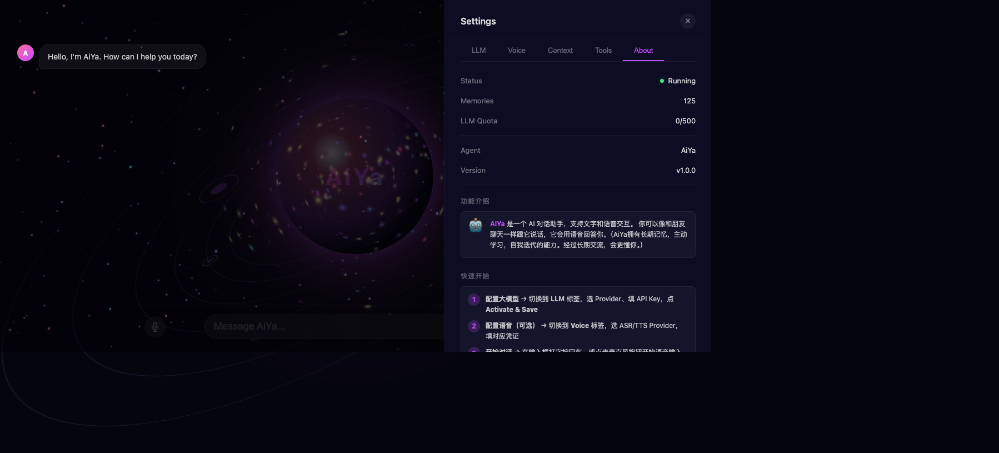
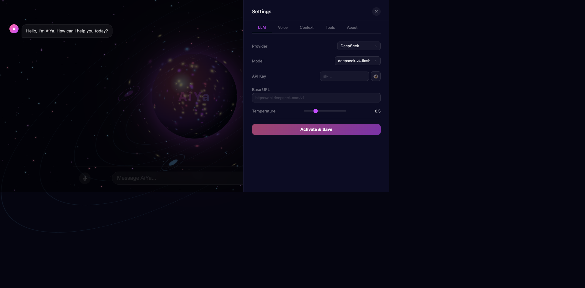
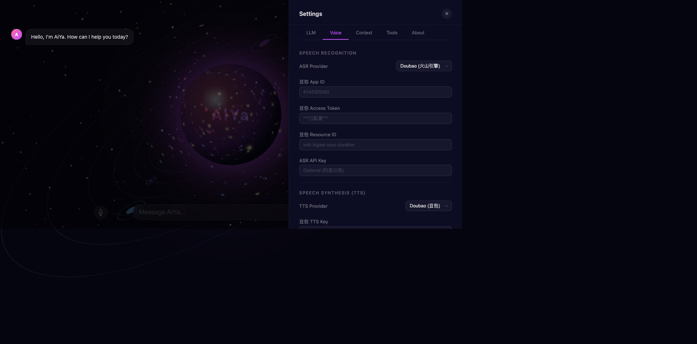
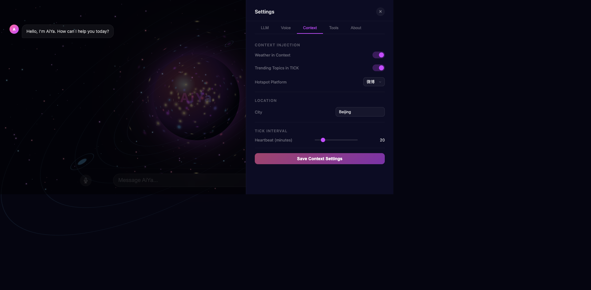
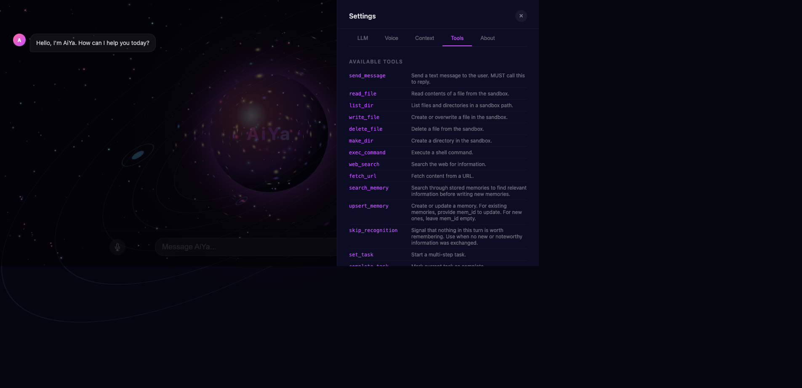
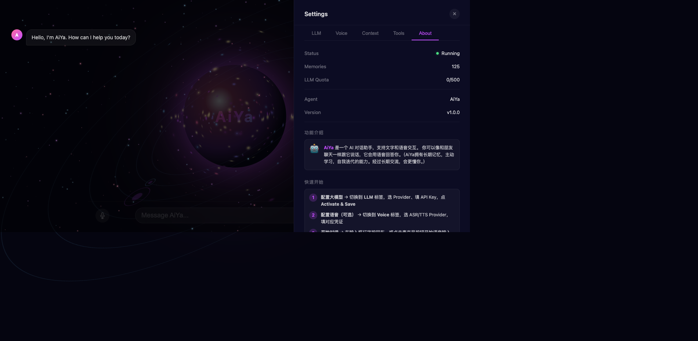

<p align="center">
  
</p>

<h1 align="center">🤖 AiYa · 爱娅</h1>

<p align="center">
  <strong>AI 对话助手 — 支持文字与语音交互，拥有长期记忆与自主学习能力</strong>
</p>

<p align="center">
  
  
  
</p>

---

## ✨ 功能亮点

- **🧠 长期记忆** — AiYa 会记住你说过的话，随着交流时间增长越来越懂你
- **🎤 语音对话** — 支持麦克风语音输入 + TTS 语音回答，像和朋友聊天一样自然
- **🔧 多模型支持** — 支持 DeepSeek、Qwen、MiniMax、OpenAI 等多种大模型
- **🎯 语音识别** — 集成火山引擎豆包 ASR、阿里云 ASR、OpenAI Whisper
- **🗣 语音合成** — 支持豆包 TTS、MiniMax TTS、OpenAI TTS，多种音色可选
- **📡 上下文感知** — 可注入天气、热搜等实时信息，让 AiYa 知道当下发生什么
- **⏱ 主动提醒** — 心跳机制，AiYa 会主动询问或推送提醒
- **🔐 隐私安全** — API Key 保存后自动隐藏，凭证仅存本地
- **🪐 炫酷 UI** — 3D 星系旋转动画 + 星空粒子背景

---

## 📸 界面预览

| 主界面 | LLM 设置 | Voice 设置 |
|:---:|:---:|:---:|
|  |  |  |

| Context 设置 | Tools 列表 | About & 说明 |
|:---:|:---:|:---:|
|  |  |  |

---

## 🚀 快速开始

### 前置要求

- Node.js ≥ 18（推荐 v24+）
- macOS / Linux / Windows 均可

### 安装

```bash
# 1. 克隆仓库
git clone https://github.com/zhanghuazi-123/AiYa-ai-agent.git
cd AiYa-ai-agent

# 2. 安装依赖
npm install

# 3. 创建环境变量文件
echo "DEEPSEEK_API_KEY=sk-your-key-here" > .env
```

### 启动

```bash
PORT=3722 node --env-file=.env src/index.js
```

浏览器打开 **http://127.0.0.1:3722** 即可使用。

---

## ⚙️ 配置指南

### LLM 模型配置

打开右侧 Settings → **LLM** 标签：

| 字段 | 说明 |
|------|------|
| **Provider** | 大模型供应商（DeepSeek / Qwen / MiniMax / OpenAI / Custom） |
| **Model** | 模型名称（如 deepseek-v4-flash, deepseek-chat） |
| **API Key** | API 密钥，点 Activate 后自动保存并隐藏 |
| **Base URL** | 可选，兼容 OpenAI API 格式的请求地址 |
| **Temperature** | 创意程度，0=严谨，1=平衡，2=放飞 |

设置完后点 **Activate & Save**，显示 ✅ 已激活即可使用。

### 语音配置

打开 Settings → **Voice** 标签：

**ASR（语音识别）：**
- **Doubao（火山引擎）** — 需填 App ID / Access Token / Resource ID
- **阿里云 ASR** — 需 API Key
- **OpenAI Whisper** — 需 API Key

**TTS（语音合成）：**
- **Doubao（豆包）** — 需 TTS Key
- **MiniMax** — 可选填 Key，留空则用 LLM Key
- **OpenAI TTS** — 需 OpenAI Key 和 Base URL

**Voice** 下拉可选不同音色，设置完后点 **Save Voice Settings**。

### 上下文配置

| 选项 | 说明 |
|------|------|
| **Weather in Context** | 对话中注入本地实时天气 |
| **Trending Topics** | 注入微博/知乎热搜，让 AiYa 知道时事 |
| **City** | 所在城市，用于天气和本地信息 |
| **Heartbeat** | 心跳间隔（分钟），AiYa 会主动询问或推送提醒 |

---

## 🎤 语音对话技巧

1. 点击麦克风按钮开始录音，再次点击停止
2. 说完话后 AiYa 会自动检测停顿并发送
3. AiYa 回答完后会恢复录音，形成自然的对话流
4. 可以随时点击麦克风按钮手动停止录音
5. 如果觉得回声大，检查音箱音量或使用耳机

> 💡 AiYa 内置回声抑制：文本去重 + 5 秒节流 + 2 秒 TTS 冷却，有效防止语音对话中的回声循环。

---

## 🛠 技术架构

```
项目结构
├── src/
│   ├── index.js          # 服务入口（HTTP + WebSocket）
│   ├── api.js            # REST API 路由
│   ├── db.js             # SQLite 数据库（better-sqlite3）
│   ├── config.js         # 配置管理
│   ├── llm.js            # LLM 客户端（OpenAI 兼容协议）
│   ├── prompt.js         # 提示词管理
│   ├── quota.js          # API 配额管理
│   ├── voice/
│   │   ├── cloud-asr.js           # ASR 工厂（路由到不同供应商）
│   │   ├── cloud-asr-doubao.js    # 火山引擎豆包 ASR v3 协议
│   │   └── ...                     # 其他 ASR/TTS 供应商
│   ├── capabilities/     # 工具函数（工具调用）
│   ├── context/          # 上下文注入（天气、热搜等）
│   ├── memory/           # 记忆系统
│   ├── providers/        # LLM 供应商适配
│   └── runtime/          # 运行时管理
├── data/                 # SQLite 数据库文件
├── app.js                # 前端主逻辑
├── index.html            # 前端 UI
├── styles.css            # 前端样式
├── stars.js              # 星空粒子动画
└── galaxy.js             # 3D 星系动画
```

### 技术栈

| 层次 | 技术 |
|------|------|
| **后端** | Node.js + HTTP Server |
| **实时通信** | WebSocket (ws@8) 原生 WebSocket 协议 |
| **数据库** | better-sqlite3 |
| **语音 ASR** | 火山引擎豆包 v3 协议 / 阿里云 / OpenAI Whisper |
| **语音 TTS** | 豆包 / MiniMax / OpenAI TTS |
| **前端** | 原生 HTML + CSS + JS（无框架依赖） |
| **LLM 协议** | OpenAI API 兼容格式 |

---

## 📋 可用工具

AiYa 内置了丰富的工具调用能力：

| 工具 | 功能 |
|------|------|
| `web_search` | 搜索互联网信息 |
| `weather` | 查询指定城市天气 |
| `generate_image` | 根据描述生成图片 |
| `set_task` / `complete_task` | 多步骤任务管理 |
| `manage_reminder` | 创建/管理提醒 |
| `upsert_memory` | 长期记忆写入 |
| `search_memory` | 长期记忆检索 |
| `speak` | 语音播报 |
| `exec_command` | 执行 Shell 命令 |
| `read_file` / `write_file` | 文件操作 |
| ... 共 25+ 个工具 |

---

## 🔧 开发

```bash
# 安装依赖
npm install

# 开发模式运行
PORT=3722 node --watch --env-file=.env src/index.js

# 测试语音识别
node test/doubao_e2e.mjs
```

### 环境变量

| 变量 | 说明 |
|------|------|
| `DEEPSEEK_API_KEY` | DeepSeek API 密钥（也可通过设置面板配置） |
| `PORT` | 服务端口（默认 3722） |

> 大多数配置可通过 Settings UI 完成，无需直接编辑环境变量或数据库。

---

## 📄 License

MIT License — 自由使用、修改和分发。

---

<p align="center">
  <sub>Built with ❤️ by <a href="https://github.com/zhanghuazi-123">zhanghuazi-123</a></sub>
</p>
